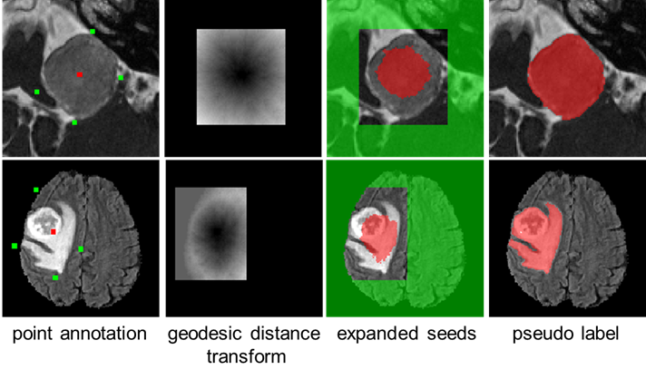
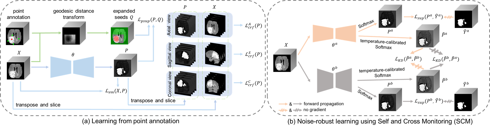

# PA-Seg
Code for this paper: PA-Seg: Learning from Point Annotations for 3D Medical Image Segmentation using Contextual Regularization and Cross Knowledge Distillation ([TMI2023](https://ieeexplore.ieee.org/document/10044712))

```
@article{zhai2023pa,
        title={PA-Seg: Learning from Point Annotations for 3D Medical Image Segmentation using Contextual Regularization and Cross Knowledge Distillation},
        author={Zhai, Shuwei and Wang, Guotai and Luo, Xiangde and Yue, Qiang and Li, Kang and Zhang, Shaoting},
        journal={IEEE Transactions on Medical Imaging},
        year={2023},
        publisher={IEEE}
}
```

## Method Overview
In the first stage, we expand the annotation seeds based on geodesic distance transform, and train an initial model using the expanded seeds, with the unlabeled pixels regularized by multi-view CRF loss and Variance Minimization (VM) loss. Pseudo labels are then obtained by using the initial model for inference. In the second stage, to deal with noises in the pseudo labels, we propose Self and Cross Monitoring (SCM), where a primary model and an auxiliary model supervise each other via Cross Knowledge Distillation (CKD) based on soft labels, in addition to self-training of each model.

*Illustration of our point annotation-based segmentation. Green: Background. Red: Foreground.*
<p align="center">
  
</p>

*An overview of the proposed PA-Seg for weakly supervised 3D segmentation based on point annotations.*
<p align="center">
  
</p>
	
## Requirements
We have only tested in the following environments. Please ensure that the version of each package is not lower than the one listed below. 
* Set up a virtual environment (e.g. conda or virtualenv) with Python == 3.8.10
* Follow official guidance to install [Pytorch][torch_link] with torch == 1.9.1+cu111
* Install other requirements using: 
```bash
pip install -r requirements.txt
```

[torch_link]: https://pytorch.org/

## Data

### Vestibular Schwannoma (VS) Segmentation

**Step 1**: Please follow the instructions [here](https://wiki.cancerimagingarchive.net/display/NBIA/Downloading+TCIA+Images) to download the NBIA Data Retriever.

**Step 2**: Open `manifest-T2.tcia` with NBIA Data Retriever and download the T2 images (DICOM, 6GB) with the "Descriptive Directory Name" format. The save path is set to `./data` .

**Step 3**: Execute the script to convert DICOM to Nifti:
```bash
python ./data/VS/convert.py \
--input ./data/manifest-T2/Vestibular-Schwannoma-SEG \
--output ./data/VS/image
```

**Step 4**: Download full annotations from [Google Drive][googledrive_link] or [ALiYun Drive][aliyundrive_link] and save them in `./data/VS/label` .

**Step 5**: Execute the script to crop the images and full annotations:
```bash
python ./data/VS/image_crop.py \
--data_dir ./data/VS/ \
--dataset_split ./splits/split_VS.csv \
--image_postfix T2 \
--label_postfix Label
```

**Step 6**: Download our proposed point annotations from [Google Drive][googledrive_link] or [ALiYun Drive][aliyundrive_link] and save them in `./data/VS/annotation_7points` . Note that the point annotations have already been cropped.

[googledrive_link]: https://drive.google.com/drive/folders/1-wx6T8ZdcMAnG6I65u2UOLDrzvKGBt-u?usp=sharing
[aliyundrive_link]: https://www.aliyundrive.com/s/QufY5VvUNgk

### Brain Tumor Segmentation (BraTS)

**Step 1**: Please follow the instructions [here](https://www.med.upenn.edu/cbica/brats2019/registration.html) to acquire the training and the validation data of the BraTS 2019 challenge. Put the dataset in the directory `./data`

**Step 2**: Execute the script to merge the three labels "enhancing tumor", "tumor core", and "whole tumor" into a single label:
```bash
python ./data/BraTS/merge_and_move.py \
--original_dir ./data/BraTS2019/MICCAI_BraTS_2019_Data_Training/ \
--destination_dir ./data/BraTS/
```

**Step 3**: Download our proposed point annotations from [Google Drive][googledrive_link] or [ALiYun Drive][aliyundrive_link] and save them in `./data/BraTS/annotation_7points`

## Usage

### The First Stage of PA-Seg: Learning from Point Annotation

Execute the script to expand the annotation seeds based on geodesic distance transform: 
```bash
# VS dataset
python ./data/VS/generate_geodesic_labels.py \
--dataset_split ./splits/split_VS.csv \
--path_images ./data/VS/image_crop/ \
--image_postfix T2 \
--path_labels ./data/VS/label_crop/ \
--label_postfix Label \
--path_anno_7points ./data/VS/annotation_7points/ \
--anno_7points_postfix 7points \
--path_geodesic ./data/VS/geodesic/ \
--geodesic_weight 0.5 \
--geodesic_threshold 0.2

# BraTS dataset
python ./data/BraTS/generate_geodesic_labels.py \
--dataset_split ./splits/split_BraTS.csv \
--path_images ./data/BraTS/image/ \
--image_postfix Flair \
--path_labels ./data/BraTS/label/ \
--label_postfix Label \
--path_anno_7points ./data/BraTS/annotation_7points/ \
--anno_7points_postfix 7points \
--path_geodesic ./data/BraTS/geodesic/ \
--geodesic_weight 0.5 \
--geodesic_threshold 0.2
```

Execute the script to train an initial model using the expanded seeds, with the unlabeled pixels regularized by multi-view CRF loss and Variance Minimization (VM) loss. Note that the `--network` parameter has three options: `U-Net2D5`, `U-Net`, and `AttU_Net`.
```bash
# VS dataset
python train_gatedcrfloss3d22d_multiview_varianceloss.py \
--model_dir ./models/VS/gatedcrfloss3d22d_multiview_varianceloss/ \
--network U_Net2D5 \
--batch_size 1 \
--max_epochs 300 \
--rampup_epochs 30 \
--dataset_split ./splits/split_VS.csv \
--path_images ./data/VS/image_crop/ \
--image_postfix T2 \
--path_labels ./data/VS/label_crop/ \
--label_postfix Label \
--path_geodesic_labels ./data/VS/geodesic/weight0.5_threshold0.2/geodesic_label/ \
--geodesic_label_postfix GeodesicLabel \
--learning_rate 1e-2 \
--spatial_shape 128 128 48 \
--weight_gatedcrf 1.0 \
--down_size 64 64 48 \
--kernel_radius 5 5 -1 \
--weight_variance 0.1

# BraTS dataset
python train_gatedcrfloss3d22d_multiview_varianceloss.py \
--model_dir ./models/BraTS/gatedcrfloss3d22d_multiview_varianceloss/ \
--network U_Net \
--batch_size 1 \
--max_epochs 500 \
--rampup_epochs 50 \
--dataset_split ./splits/split_BraTS.csv \
--path_images ./data/BraTS/image/ \
--image_postfix Flair \
--path_labels ./data/BraTS/label/ \
--label_postfix Label \
--path_geodesic_labels ./data/BraTS/geodesic/weight0.5_threshold0.2/geodesic_label/ \
--geodesic_label_postfix GeodesicLabel \
--learning_rate 1e-2 \
--spatial_shape 128 128 128 \
--weight_gatedcrf 1.0 \
--down_size 64 64 64 \
--kernel_radius 5 5 -1 \
--weight_variance 0.1
```

Perform inference on the test dataset using `inference.py` to obtain segmentation results. Then, execute `utilities/scores.py` to obtain evaluation metrics such as "dice" and "assd" for the segmentation results.
```bash
# VS dataset
python inference.py \
--model_dir ./models/VS/gatedcrfloss3d22d_multiview_varianceloss/ \
--network U_Net2D5 \
--dataset_split ./splits/split_VS.csv \
--path_images ./data/VS/image_crop/ \
--image_postfix T2 \
--phase inference \
--spatial_shape 128 128 48 \
--epoch_inf best

python utilities/scores.py \
--model_dir ./models/VS/gatedcrfloss3d22d_multiview_varianceloss/ \
--network U_Net2D5 \
--dataset_split ./splits/split_VS.csv \
--image_postfix T2 \
--phase inference \
--path_labels ./data/VS/label_crop/ \
--label_postfix Label

# BraTS dataset
python inference.py \
--model_dir ./models/BraTS/gatedcrfloss3d22d_multiview_varianceloss/ \
--network U_Net \
--dataset_split ./splits/split_BraTS.csv \
--path_images ./data/BraTS/image/ \
--image_postfix Flair \
--phase inference \
--spatial_shape 128 128 128 \
--epoch_inf best

python utilities/scores.py \
--model_dir ./models/BraTS/gatedcrfloss3d22d_multiview_varianceloss/ \
--network U_Net \
--dataset_split ./splits/split_BraTS.csv \
--image_postfix Flair \
--phase inference \
--path_labels ./data/BraTS/label/ \
--label_postfix Label
```

### The Second Stage of PA-Seg: Noise-robust learning using Self and Cross Monitoring (SCM)

Execute the script to train enhanced models using SCM:
```bash
# VS dataset
python train_SCM.py \
--pretrained_model1_dir ./models/VS/gatedcrfloss3d22d_multiview_varianceloss/ \
--network1 U_Net2D5 \
--pretrained_model2_dir ./models/VS/gatedcrfloss3d22d_multiview_varianceloss/ \
--network2 AttU_Net \
--model_dir ./models/VS/SCM/ \
--batch_size 1 \
--max_epochs 100 \
--iterative_epochs 20 \
--dataset_split ./splits/split_VS.csv \
--path_images ./data/VS/image_crop/ \
--image_postfix T2 \
--path_labels ./data/VS/label_crop/ \
--label_postfix Label \
--learning_rate 1e-2 \
--spatial_shape 128 128 48 \
--weight_kd 0.5 \
--T 4.0

# BraTS dataset
python train_SCM.py \
--pretrained_model1_dir ./models/BraTS/gatedcrfloss3d22d_multiview_varianceloss/ \
--network1 AttU_Net \
--pretrained_model2_dir ./models/BraTS/gatedcrfloss3d22d_multiview_varianceloss/ \
--network2 U_Net \
--model_dir ./models/BraTS/SCM/ \
--batch_size 1 \
--max_epochs 100 \
--iterative_epochs 20 \
--dataset_split ./splits/split_BraTS.csv \
--path_images ./data/BraTS/image/ \
--image_postfix Flair \
--path_labels ./data/BraTS/label/ \
--label_postfix Label \
--learning_rate 1e-2 \
--spatial_shape 128 128 128 \
--weight_kd 0.5 \
--T 4.0
```

Run the inference using the main network by executing `inference.py`. Then, execute `utilities/scores.py` to obtain evaluation metrics.
```bash
# VS dataset
python inference.py \
--model_dir ./models/VS/SCM/ \
--network U_Net2D5 \
--dataset_split ./splits/split_VS.csv \
--path_images ./data/VS/image_crop/ \
--image_postfix T2 \
--phase inference \
--spatial_shape 128 128 48 \
--epoch_inf best_model1

python utilities/scores.py \
--model_dir ./models/VS/SCM/ \
--network U_Net2D5 \
--dataset_split ./splits/split_VS.csv \
--image_postfix T2 \
--phase inference \
--path_labels ./data/VS/label_crop/ \
--label_postfix Label

# BraTS dataset
python inference.py \
--model_dir ./models/BraTS/SCM/ \
--network U_Net \
--dataset_split ./splits/split_BraTS.csv \
--path_images ./data/BraTS/image/ \
--image_postfix Flair \
--phase inference \
--spatial_shape 128 128 128 \
--epoch_inf best_model1

python utilities/scores.py \
--model_dir ./models/BraTS/SCM/ \
--network U_Net \
--dataset_split ./splits/split_BraTS.csv \
--image_postfix Flair \
--phase inference \
--path_labels ./data/BraTS/label/ \
--label_postfix Label
```

Our pre-trained models can be download from [Google Drive][googledrive_link] or [ALiYun Drive][aliyundrive_link].


## Acknowledgement
This code is adapted from [InExtremIS](https://github.com/ReubenDo/InExtremIS). We thank Postdoc Reuben Dorent for his elegant and efficient code base.
